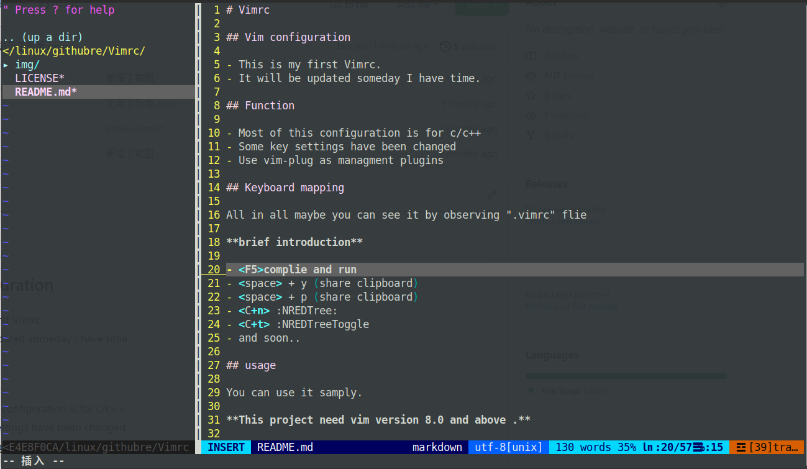

# Vimrc.org

## Vim configuration

- This is my first Vimrc.
- It will be updated someday I have time.

## Function

- Most of this configuration is for c/c++
- Some key settings have been changed
- Use vim-plug as managment plugins

## Keyboard mapping

All in all maybe you can see it by observing ".vimrc" flie

**brief introduction**

- <F5>complie and run
- <space> + y (share clipboard)
- <space> + p (share clipboard)
- <C+n> :NREDTree:
- <C+t> :NREDTreeToggle
- and soon..

## usage

You can use it samply.

**This project need vim version 8.0 and above .**

Use this command
```bash
git clone git@github.com:BehindShadow/Vimrc.git
```

then 
```bash
vim
```

then using the following command to Install the plug 
```bash
:PlugInstall
```


## Screen Shot




